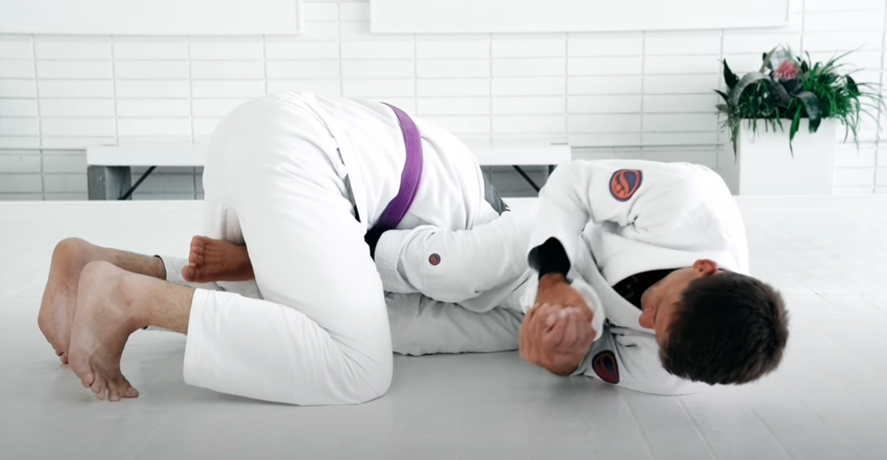
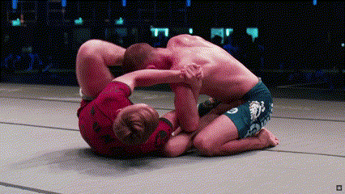

[Comment]: # (Markdown does not natively support centered text, use html instead)
<h1 align="center">Choi Bar</h1>

    

## What is the Choi Bar?

The Choi Bar is a an entry to the belly down armbar. As seen below, to perform the traditional belly down armbar the attacker would rotate away from the opponent bringing thier leg, on the same side as the arm which they are attacking, over the opponents shoulder.

    <figcaption><i>Belly Down Armbar from De La Riva [1]</i></figcaption>
    

Now to perform the *Choi Bar* entry to the belly down armbar the attacker will rotate towards the opponent and bring the opposite side leg over the opponents shoulder and head.

    <figcaption><i>Choi Bar[2]</i></figcaption>
    

## Does the Choi Bar work?

    <figcaption><i>Choi vs Unknown, IBJJF Worlds 2014 [A]</i></figcaption>
    
    <figcaption><i>Ryan vs Harris, Polaris 7 [B]</i></figcaption>
    
    <figcaption><i>Galvao vs Canuto, ADCC 2022 [C]</i></figcaption>
    
    <figcaption><i>Oflanagan vs Ribeiro, ADCC 2022 [D]</i></figcaption>
    
    <figcaption><i>Jones vs Costa, ADCC 2022 [E]</i></figcaption>
    

## How to do the Choi Bar

    <figcaption><i>Jones Choi Bar from Half Guard [4]</i></figcaption>
    
    <figcaption><i>Degle Choi Bar from Butterfly Guard [9]</i></figcaption>
    

#### Entry positions
- From the Front Headlock [2]
- From Butterfly Guard [9]
- From Half Guard [E, D]

#### Grips
- Shoulder Crunch
  - Gable [2, B, D]
  - Butterfly [4, 9]
- Kimura [F]

#### Clearing the Head
- Swing the leg around and over the head [2, A, C]
- Slide the knee under the head [D, E]

#### Finish positions
- Belly down
  - Hips towards the ground
  - Hips towards the opponents feet [2, C, E] 
- Roll through to standard armbar
  - Hips towards the ceiling [A, D]

## Choi Bar counters and transitions

#### Opponent clasps hands together to defend armbar -> transition to back take.

    <figcaption><i>Grippo vs Hernandez, IBJJF Las Vegas Open 2019 [F]</i></figcaption>
    

#### Opponent holds their inner thigh to defend armbar -> transition to triangle choke.

    <figcaption><i>Grippo vs Hernandez, IBJJF Las Vegas Open 2019 [F]</i></figcaption>
    

## References

#### Competitions

[Comment]: # (Markdown does not natively support alpha lists, use html instead)
<ol type="a">
    <!--
    <li>
        <a href="url">"Video Title"</a>, <i>Website</i>, uploaded by Author, Day Month Year, Timestamp M:SS
    </li>
    -->
    <li>
        <a href="https://www.youtube.com/watch?v=5Z-HadXdSu0">"IBJJF Worlds 2014 Choi Won Choi won by Choi bar 30 sec."</a>, <i>YouTube</i>, uploaded by KINYABOYZ TOKYO, 8 June 2014, Timestamp 0:10
    </li>
    <li>
        <a href="https://www.youtube.com/watch?v=xkezk6lxQQc&t=105s">"Polaris 7 Highlights"</a>, <i>YouTube</i>, uploaded by Polaris Professional Jiu Jitus Invitational, 14 August 2018, Timestamp 1:30
    </li>
    <li>
        <a href="https://www.youtube.com/watch?v=Wv4BRC-x1yQ">"Mica Galvao vs Renato Canuto 2022 ADCC World Championships"</a>, <i>YouTube</i>, uploaded by FloGrappling, 3 October 2022, Timestamp 2:10
    </li>
    <li>
        <a href="https://www.youtube.com/watch?v=BKZ6Dt7SpYE">"RISING STAR VS LEGEND: Xande Ribeiro vs Eoghan O'Flanagan | 2022 ADCC World Championships"</a>, <i>YouTube</i>, uploaded by FloGrappling, 9 January 2023, Timestamp 1:10
    </li>
    <li>
        <a href="https://www.youtube.com/watch?v=BmulmE8MyK4">"Craig Jones Lands Lightning Fast Submission Against Joao Costa | 2022 ADCC World Championships"</a>, <i>YouTube</i>, uploaded by FloGrappling, 10 June 2023, Timestamp 0:20
    </li>
    <li>
        <a href="https://www.youtube.com/watch?v=T8W6gL9D214">"Gianni Grippo VS Emilio Hernandez / Las Vegas Open 2019 "</a>, <i>YouTube</i>, uploaded by IBJJF (International Brazilian Jiu-Jitsu Federation), 4 September 2019, Timestamp 5:50
    </li>
</ol>

#### Instructionals

[Comment]: # (1. ["Video Title"]\(url\), *Website*, uploaded by Author, Day Month Year)
1. ["Rafael Mendes | Armbar + Crucifix Options Versus Single Leg | artofjiujitsu.com"](https://www.youtube.com/watch?v=Bg6WtFOBq4s&t=325s), *YouTube*, uploaded by ART OF JIU JITSU, 22 June 2018
2. ["Lachlan Giles Breaks Down Mica Galvao's Choi Bar"](https://www.youtube.com/watch?v=_cnEnoQUGv8), *YouTube*, uploaded by FloGrappling, 13 April 2023
3. ["The Half Butterfly Guard Of Eoghan O'Flanagan | Lachlan Giles Breakdown"](https://www.youtube.com/watch?v=btXFGa6al84), *YouTube*, uploaded by FloGrappling, 3 January 2023
4. ["Choi Bar from Z-Guard (Craig Jones)"](https://www.youtube.com/watch?v=bqgPyeCdaLY), *YouTube*, uploaded by Absolure MMA St Kilda - Melbourne, 8 July 2017
5. ["How To Set Up The Choi Bar With ADCC Athlete Eoghan O'Flanagan"](https://www.youtube.com/watch?v=xv5qnUqQm-A), *YouTube*, uploaded by The Charles Eoghan Experience, 28 January 2023
6. ["How Craig Hit The 2nd Fastest Sub at ADCC | Craig Jones B-Team Technique"](https://www.youtube.com/watch?v=Vb5wX2Vf1Wc), *YouTube*, uploaded by B-Team Jiu Jitsu, 10 October 2022
7. ["Arizona Camp March 2022: Choi bar the World with Melson Puentes"](https://www.youtube.com/watch?v=-Yt9GBWDCOQ), *YouTube*, uploaded by BJJ Globetrotters in Action, 3 June 2022
8. ["Craig Jones - Z-Half Guard Armbar (Bringing Leg Over The Head)"](https://www.youtube.com/watch?v=1AXix_eKyKc), *YouTube*, uploaded by The Grapplers Guide by Jason Scully, 10 January 2020
9. ["Arm saddle position introduction: Creating dilemmas inside the best Armlocking position for NoGi"](https://www.youtube.com/watch?v=FaxveC8KqnE&t=678s), *YouTube*, uploaded by RobertDegleJJ, 23 September 2020
